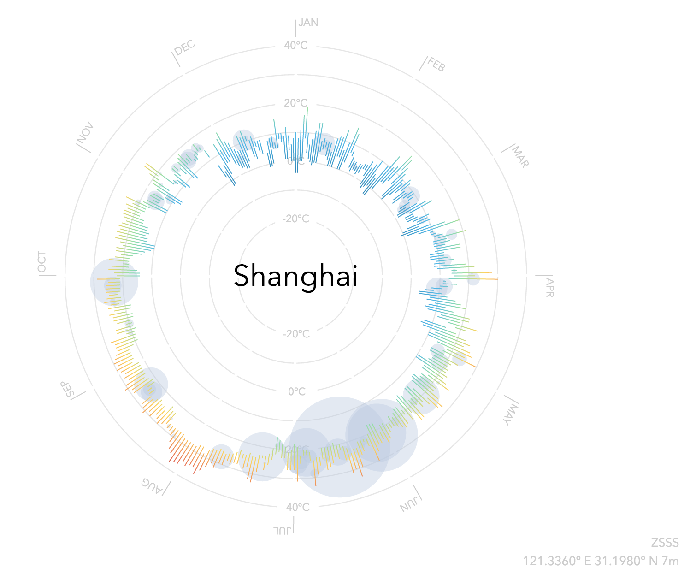

# the-days

He who lives day by day,  who dies hour by hour, is here and there.

This is a small implementation of [weather radials](http://weather-radials.com/) inspired by [raureif](http://raureif.net/en/). 
It digests daily weather of 2015 into a vivid infograph.

# [Demo](https://days.crvv.me)

# Usage
Use `npm start` to start server and visit `http://localhost:2488`.

On the website, use `⌘` + `s` or `⌃` + `s` to save as svg files to local system.
